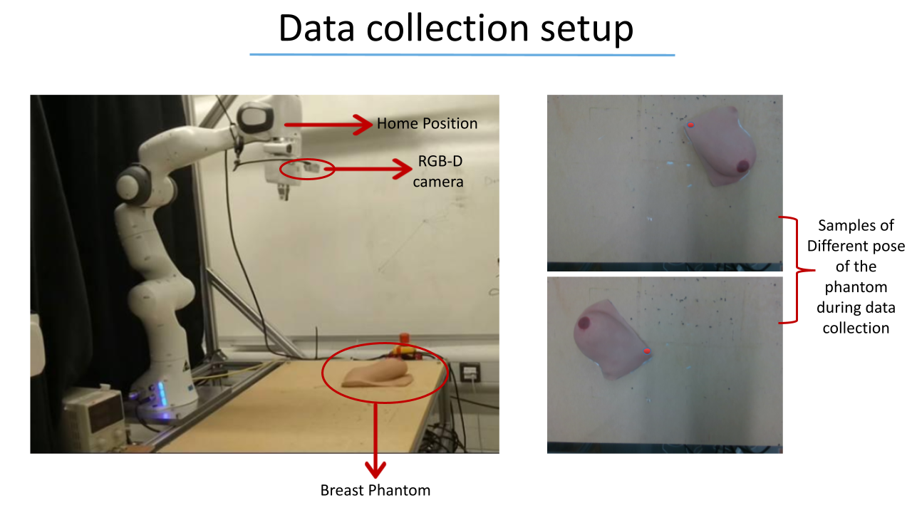

# Deep Movement Primitives: toward Breast Cancer Examination Robot

This repository collects the code to run the experiments detailed in the paper "Deep Movement Primitives: toward Breast Cancer Examination Robot".

- [Deep Probabilistic Movement Primitives: Toward breast cancer examination robot](#deep-probabilistic-movement-primitives-toward-breast-cancer-examination-robot)
  - [ARTEMIS project](#artemis-project)
  - [Usage](#usage)
    - [Prerequisites](#prerequisites)
    - [Setup](#setup)
    - [Running](#running)
  - [Framework and tasks](#framework-and-tasks)
  - [Data collection](#data-collection)
  - [Experiments](#experiments)
  - [Extra material](#extra-material)
  - [References](#references)

## ARTEMIS project

This paper was published as part of the ARTEMIS project, a collaborative 1-year project funded by Cancer Research UK. Partners in this project include the University of Lincoln, University of Bristol, University of Bradford and Imperial College London.

Early breast cancer detection has a significant impact on extending survival and improving quality of life. Young women with breast cancer account for 7% of all breast cancers. Diagnostic delays are common and they present often at an advanced stage, with the more aggressive and less responsive disease to hormonal therapy. ARTEMIS aims at developing an intelligent robotic system that will help early breast cancer detection.

## Usage

### Prerequisites

`git` is suggested to clone the repository and `conda` to create a Python virtual environment. All the necessary packages will be installed by conda in the virtual environment as listed in `conda_env.yaml`, however the main requirements are:

- Python 3.9 (older 3.x versions will work, but type annotations will have to be modified)
- Tensorflow 2.4 (2.2 should work as well)

### Setup

1. Clone this repository on your local machine:
   ```
   git clone git@github.com:imanlab/deep_movement_primitives.git
   ```
2. Download the datasets from [here]() and extract them in the `data` folder. When you are done the `data` folder should contain the three `rtp-rgb`, `rtp-rgbd` and `wpp-rgb` folders. 
   <!-- TODO: add link to donwload the datasets. -->
3. Create and activate a `conda` virtual environment with all the necessary packages detailed in the `conda_env.yaml` file. You can change the name to whatever you want:
   ```
   cd /path/to/cloned/repo/deep_movement_primitives
   conda env create -f conda_env.yaml -n "deep_movement_primitives"
   conda activate "deep_movement_primitives"
   ```

### Running

From the root folder of the repository experiments can be run with:

```
python -m experiments.EXPERIMENT_NAME.experiment run
```

This will train and evaluate the model of the specified experiment.

Additional advanced options (e.g. train/evaluate only, run multiple times and aggregate the average and standard deviation of the metrics) are detailed [here](docs/experiments.md).

## Framework and tasks

ProMPs (Probabilistic Movement Primitives [[1]](#ref-1)) are a probabilistic framework for Motion Primitives, which can encode a distribution of continuous trajectories as a distribution of discrete weights and a set of basis functions.  
We introduced the concept of deep movement primitives, a learning from demonstrations framework, which can be used to map an input (e.g. an image) to the ProMP weights which encode a trajectory or a distribution of trajectories, effectively mapping the input to the trajectory.

This framework was applied and tested on two tasks:

- **Reach-To-Palpate** (RTP): the model receives as input an image taken from a camera mounted on the end effector of a robot arm and outputs the trajectory to reach the nipple from the starting position (experiments 01-07).
- **Wedged-Palpation-Path** (WPP): the model receives as input an image taken from a camera mounted on the end effector of a robot arm, plus an arbitrary point on the breast phantom (selected by the user) and outputs the palpation trajectory going from the nipple to the point selected by the user (experiments 08-20).

For each task different models were evaluated:

 - **Fully Connected** (FC): a simples dense NN, taking the flattened bottleneck layer from the autoencoder as input and predicting ProMP weights (experiments 01 and 03).
 - **Convolutional** (CNN): a convolutional NN, taking the bottleneck layer from the autoencoder as input and predicting ProMP weights (experiments 02, 04, 05, 08, 09, 11-20).
 - **PointNet**: a model derived from PointNet [[2]](#ref-2), taking the point cloud from home position, extracting a feature vector and feeding it through a dense NN to predict ProMP weights (experiment 06)
 
Some variations of the standard algorithm were evaluated as well:

 - **residual ProMP weights**: the model is not trained on the *full ProMP weights*, but on the *residual ProMP weights*, defined as the *full ProMP weights* minus the *average of all ProMP weights*. This reduces the complexity of the trajectory to be learned (experiments 05, 09).

## Data collection

The data was collected using a [Franka Emika](https://www.franka.de/robot-system) 7-dof robot arm. An [Intel Realsense D435](https://www.intelrealsense.com/depth-camera-d435/) RGBD camera and a [XELA uSkin XR1946](https://xelarobotics.com/xr1946) tactile sensor were mounted on the end effector of the robot.



The data from the tactile sensor were acquired during the WPP demonstrations, but were not used in this work, while the camera was used to take RGBD images of the breast phantom from the home position.

Three datasets were collected, as described [here](docs/datasets.md).

## Experiments

A complete documentation of all experiments with advanced instructions on how to run them can be found [here](docs/experiments.md). Additional comments can be found in the source files.

## Extra material

A video presenting the models and some demonstrations on a real robot is available [here](). <!-- TODO: Add link to video demonstration. -->

## References

<a id="ref-1">[1]</a> A. Paraschos, C. Daniel, J. Peters, and G. Neumann, ‘Probabilistic Movement Primitives’, in Proceedings of the 26th International Conference on Neural Information Processing Systems - Volume 2, 2013, pp. 2616–2624.

<a id="ref-2">[2]</a> C. R. Qi, H. Su, K. Mo, and L. J. Guibas, ‘PointNet: Deep Learning on Point Sets for 3D Classification and Segmentation’, arXiv:1612.00593 [cs], Apr. 2017. Available: http://arxiv.org/abs/1612.00593

<a id="ref-3">[3]</a> A. Kendall and R. Cipolla, ‘Geometric Loss Functions for Camera Pose Regression with Deep Learning’, arXiv:1704.00390 [cs], May 2017. Available: http://arxiv.org/abs/1704.00390
